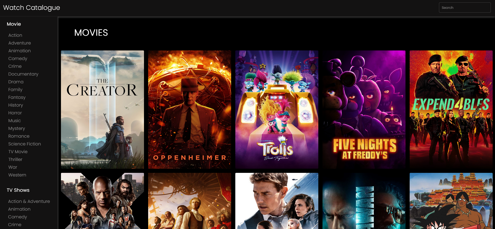

# Watch Catalogue Webpage

## Overview

The **Watch Catalogue Webpage** is a simple user-friendly interface designed for browsing and discovering both movies and TV shows. It utilizes the TMDB (The Movie Database) API to fetch relevant data and display it to users. The webpage offers a responsive design, a variety of genres for selection, and a search functionality for users to find specific movies or TV shows.

## Technologies Utilized

- **HTML**: The backbone for structuring the webpage content.
- **CSS**: Used for styling and ensuring a visually appealing user interface.
- **JavaScript**: Enables dynamic content loading, interaction, and API calls.
- **TMDB API**: Integrated to fetch information about movies and TV shows.
- **ChatGPT**: Provided useful code analysis and template production
## API Overview

The app interacts with the TMDB API to retrieve information about movies and TV shows. The API requests are made with an API key, and various endpoints are utilized to get popular movies, TV shows, and search results.

## Functions

### Movie and TV Show Display

- **`getMovies(url)`**: Fetches and displays a list of popular movies.
- **`getTVshows(url)`**: Fetches and displays a list of popular TV shows.
- **`showMovies(movies)`**: Populates the webpage with movie cards.
- **`showTVshows(tvShows)`**: Populates the webpage with TV show cards.

### Search Functionality

- **`searchMedia(searchTerm, mediaType)`**: Searches for movies or TV shows based on the user's input.
- **`showCombinedResults(results)`**: Displays the combined results of movie and TV show searches.

### Genre Selection

- **`addGenreClickListener(genreList, mediaType, getMediaFunction)`**: Listens for genre clicks and updates the content accordingly.

### Navigation

- **`handleNavButtonClick()`**: Manages the visibility and animation of the responsive navigation bar.

## Code Structure

The code is organized into three main sections: HTML, CSS, and JavaScript.

- **HTML**: Defines the structure of the webpage, including headers, containers, and movie cards.
  
- **CSS**: Provides styling for the webpage, including color schemes, fonts, and responsiveness.

- **JavaScript**: Contains functions for API interaction, content display, and user interaction.

## Minor Bugs

- **Overflow Issue for Landscape Mobile**: May experience a slight overflow issue on landscape-oriented mobile devices.
- **Catalogue CSS Styling Issue**: When selecting catalogue list items, there is a CSS styling issue where both items may appear bold, but only one remains visually marked as active.

---

